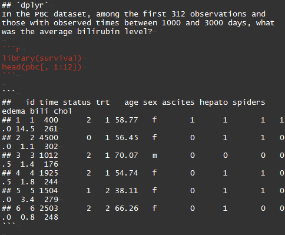
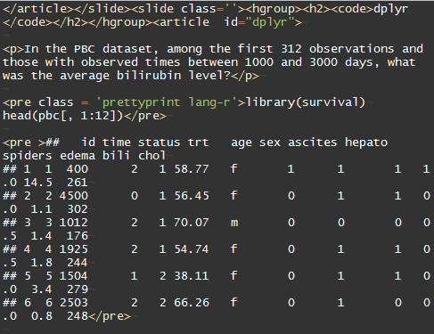
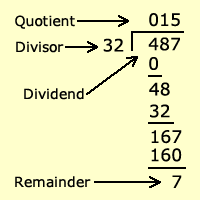
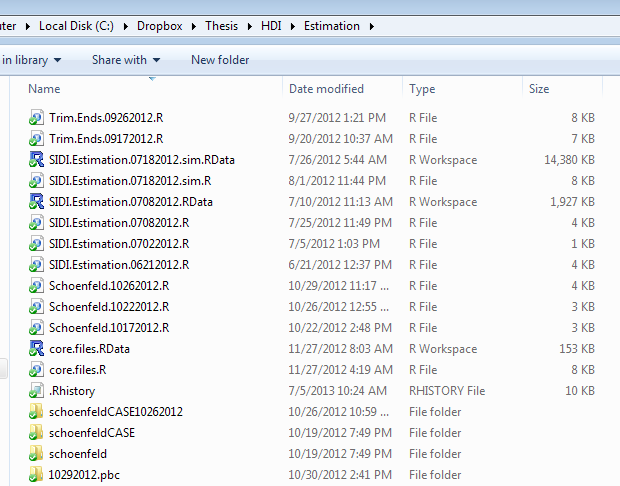

## Overview
Tools to minimize mental overhead and bookkeeping

- `dplyr` and pipes (`%>%`)
- R Markdown
- Git and GitHub

Common theme: making existing tools more user friendly. Really easy to pick up!!!

## Credits
[Jenny Bryan's presentation](http://www.fields.utoronto.ca/video-archive/2015/02/318-4374): inspiration for much of this talk

[dplyr tutorial](http://cran.rstudio.com/web/packages/dplyr/vignettes/introduction.html)

[magrittr tutorial](http://blog.rstudio.org/2014/12/01/magrittr-1-5/): `R` package for pipes (`%>%`)

[R Markdown documentation](http://rmarkdown.rstudio.com/)

[GitHub education discount](https://education.github.com/): 5 private repos for free

[Hosting your webpage on GitHub](https://pages.github.com/)

[stringr tutorial](http://stat545-ubc.github.io/block022_regular-expression.html)

[SQLite tutorial](http://www.sqlite.org/queryplanner.html): primer on SQL syntax

## `dplyr`
In the PBC dataset, among the first 312 observations and those with observed times between 1000 and 3000 days, what was the average bilirubin level?
```{r, message=FALSE}
library(survival)
head(pbc[, 1:12])
```

## `dplyr`
```{r}
mean(pbc[1:312,][pbc[1:312,]$time>1000 & pbc[1:312,]$time<3000, "bili"])
```

```{r}
mean(subset(pbc[1:312, ], time>1000 & time<3000)$bili)
```
Concise but difficult to read code

## `dplyr`
```{r}
pbc312 <- pbc[1:312, ]
pbcsub <- pbc312[pbc312$time>1000 & pbc312$time<3000, ]
mean(pbcsub$bili)
```
Easier to read but clutters workspace with unnecessary variables

## `dplyr`
```{r, message=FALSE, warning=FALSE}
library(dplyr)
pbc %>%
  slice(1:312) %>%
  filter(time>1000 & time<3000) %>%
  summarise(mean(bili))
```
intuitive functions + piping!

## `dplyr`
What are the average log(bilirubin) levels for each sex?
```{r}
pbc %>%
  slice(1:312) %>%
  mutate(lbili=log(bili)) %>%
  group_by(sex) %>%
  summarise(mean(lbili))
```

## `dplyr`
Cox regression on age and log(bilirubin)
```{r}
pbc %>%
  slice(1:312) %>%
  mutate(status01=(status==2)*1, lbili=log(bili)) %>%
  coxph(Surv(time, status01)~age+lbili, data=.)
```

## `dplyr`
- Set of functions that streamline and standardize syntax of some base `R` functions
- Piping paradigm (optional but useful)
    - RStudio shortcut for `%>%`: `Ctrl-Shift-M` (Windows/Linux), `Cmd+Shift+M` (Mac)
- Works on `data.frame`, `data.table`, and even SQL databases
- `tbl`: wrapper for `data.frame` for nicer default printing

Pipes may not seem profound at first glance, but consider the frequent scenario where you (or a collaborator!) revisit months-old code and waste minutes/hours deciphering your code. Pipes make your code much easier for a human to read.

Not convinced? Maybe an [hour-long presentation](http://www.fields.utoronto.ca/video-archive/2015/02/318-4371) by Hadley Wickham will.

## `tidyr`
I won't focus on this here, but if your data is really messy then `tidyr` will help. Use `tidyr` to "tidy" your messy data, and then `dplyr` to ready for analysis.

**Example**: longitudinal measurements for an individual are in the same row but each observation time should have its own row. `tidyr` functions can help.

[Here](http://cran.r-project.org/web/packages/tidyr/vignettes/tidy-data.html) is an introduction.

## R Markdown
Overly dramatic definition:

**R Markdown is a way to avoid terrible things like HTML or LaTeX.**

Less dramatic definition:

**Sweave except for HTML**

I made this presentation using R Markdown. See the source in my [GitHub repository](https://github.com/liangcj/toolspresentation). In particular `ToolsPresentation.Rmd`

## R Markdown
`.Rmd` code for slide 4 (this is what you see and touch):


## R Markdown
`.md` code for slide 4 (intermediate file that is auto-generated from the `.Rmd` file):



## R Markdown
`.html` code for slide 4 (what the web browser sees; auto-generated from the `.md` file):



## R Markdown
This is what your audience members see (web browser turns `.html` into human readable format):


## R Markdown
I still think it's important to learn HTML and LaTeX, in the same way I think it's important to learn how to do long division and integrate by parts using a pencil and paper.




## R Markdown
When I click "Knit HTML" in RStudio, it's just running `render()` from the `rmarkdown` package.

Takes my R Markdown (`.Rmd`) file, converts to a Markdown (`.md`) file, and finally to an HTML file (`.html`). All three of these files are in my repository for reference. In practice, the only file you need to touch is the `.Rmd` file.

Backend: `render()` in turn uses `knitr` (R package by [Yihui Xie](https://github.com/yihui)) and `pandoc` ("swiss-army knife" document format converter)

## Why so many steps?
Web browsers convert HTML code to the websites you see. So to make websites, people used to code directly in HTML.

[John Gruber](http://daringfireball.net/projects/markdown/) got tired of the cumbersome "markups" needed even for simple HTML documents, so created Mark*down*, a language that simplifies frequently used HTML commands.

Example: to italicize text, type `*italics*` instead of `<em>italics</em>`)

John Gruber is not a statistician though. Luckily, the RStudio people are, so they created R Markdown, which allows you to embed R code in Markdown files, similar to how Sweave allows you to embed R code in LaTeX files.


## Life without version control =( {.centered}


## Git {.centered}
Developed by Linus Torvalds (creator of Linux) in 2005


## Git {.centered}
**Open source** version control


## Git/GitHub {.centered}


## GitHub
- Run by a [for profit company](https://github.com/liangcj)
- Think Dropbox where you have to manually backup and write a quick summary of what changed.
- Added social component

Alternatives: GitLab, Bitbucket (but GitHub is the dominant product)

Options for using:

- RStudio interface
- Programs developed by GitHub for [Windows](https://windows.github.com/) or [Mac](https://mac.github.com/)
- Yet more [3rd party programs](http://git-scm.com/downloads/guis)
- Command line ([here](https://try.github.io/levels/1/challenges/1) is an interactive tutorial)

## Other Git/GitHub notes
GitHub repositories are public. Private repos cost money (though [educational discount](https://education.github.com/) gives you 5 free private repos).

GitHub can render markdown files into html for you.

Host class or [personal webpages](https://github.com/liangcj/liangcj.github.io) (GitHub uses [Jekyll](https://pages.github.com/)).

[Simple tutorial](https://pages.github.com/) for using GitHub to host your website.